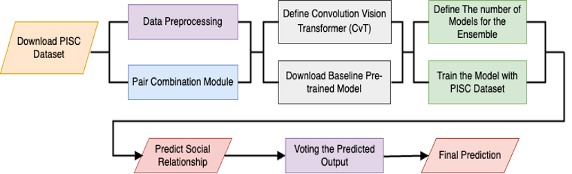
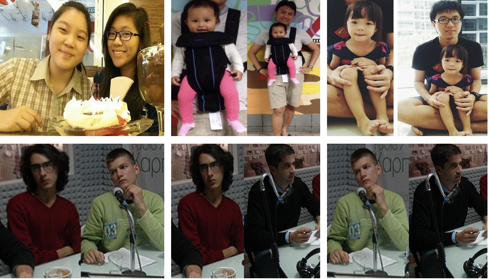
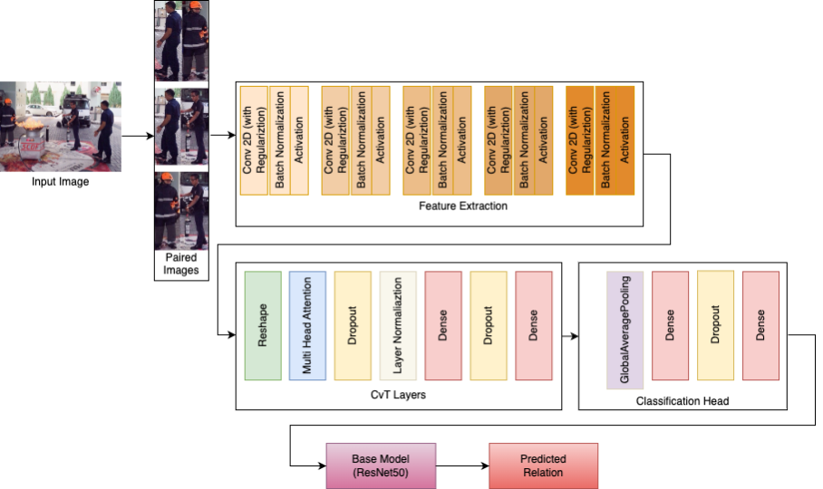
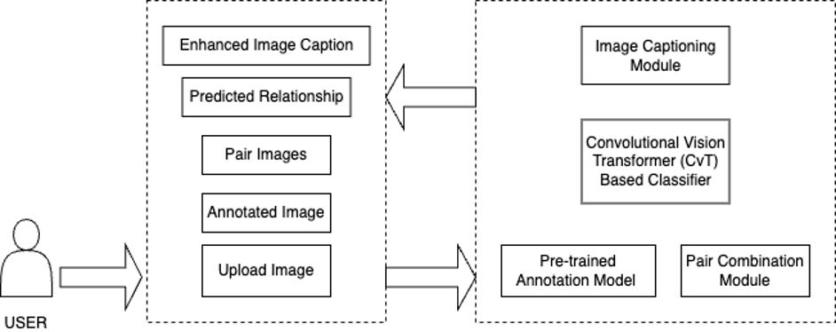
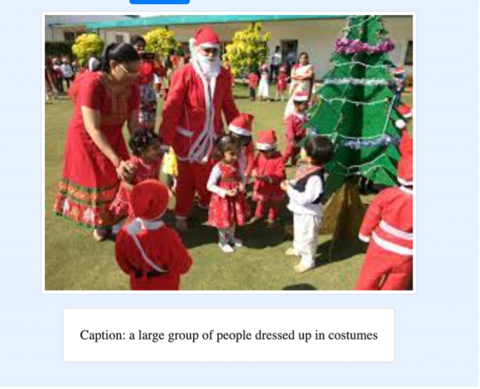
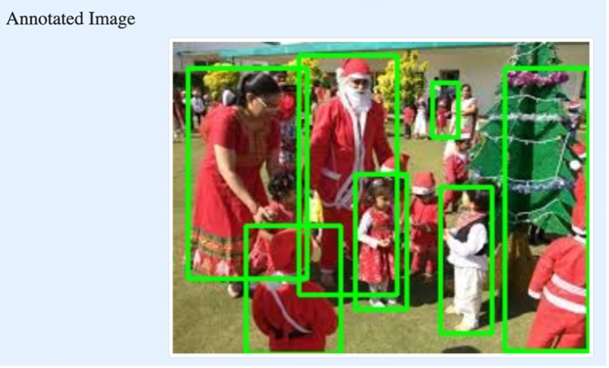
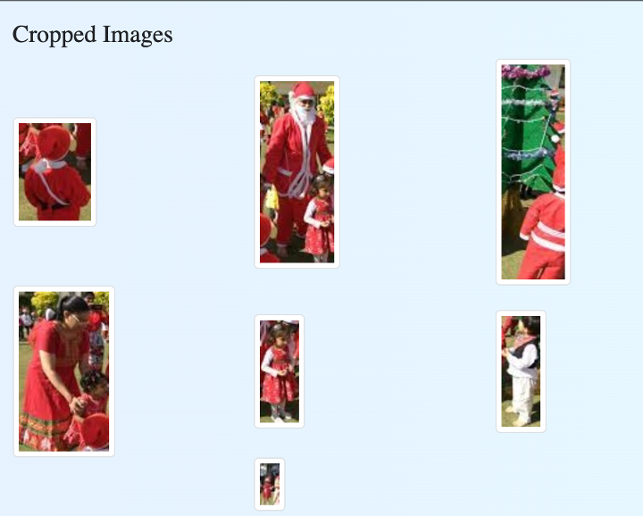
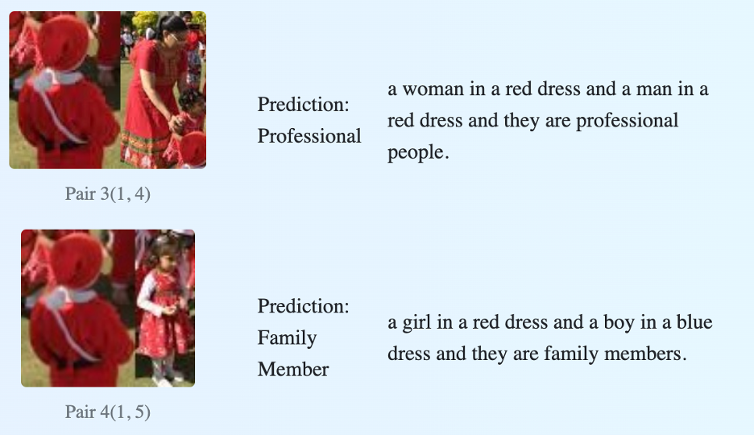
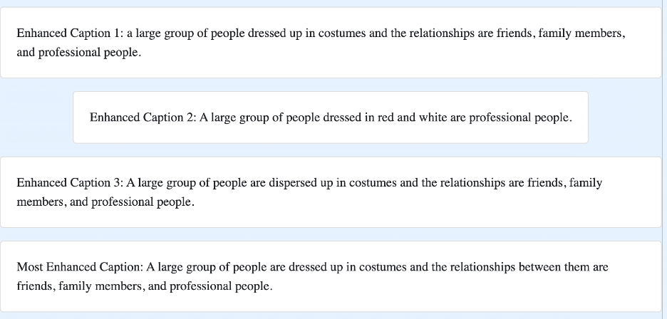

# Convolutional Vision Transformer Approach with Ensemble Method for Social Relationship Recognition

## Introduction

### Context
- Importance of social relationship recognition in images, particularly with the rise in online image sharing.
  
### Challenges
- Difficulty in distinguishing between different social relationships from images.
- Need for more effective learning algorithms and datasets.

## Project Plan

### Objective
- Develop a method that combines computer vision and ensemble methods for accurate social relationship recognition.

### Methodology
- Utilizes Convolutional Vision Transformer (CvT) and ensemble method with class weights to address class imbalance.
- Involves creating a prototype system for generating descriptive captions based on recognized relationships.
  


## Dataset

### PISC Dataset
- A publicly available dataset used for training and evaluating the models, containing images annotated with various types of social relationships.
- Dataset Link: [PISC Dataset on Zenodo](https://zenodo.org/records/1059151)
  
 <!-- Adjust width as needed -->

## Data Preprocessing

### Steps
- Reading annotation and relationship JSON files.
- Cropping images based on bounding boxes.
- Pairing images and creating a dataset with image ID, and relationship.

## Model Description


### CvT and Transfer Learning Model
- Approach uses a convolutional vision transformer and a transfer learning model based on ResNet50 architecture.
  


## Performance Evaluation

### Results
- Models demonstrate competitive performance with state-of-the-art models.
- Includes confusion matrices, testing accuracy, mean average precision (mAP), and comparisons with other models.

## EN-CvTSRR: An Ensemble Approach

### Ensemble Method
- Creating multiple instances of the model with different initializations, trained independently with different subsets, and combined using voting for final predictions.

## Conclusion

### Summary
- Experimental results show that proposed methods are effective in multi-class social relationship recognition which can be applied to photo analysis.
- An example application is presented by recognizing social connections in photos and producing relevant captions based on those connections. 


# Web Application: Enhanced Image Captioning Implies Social Relationships

The proposed CvT based system is an innovative web application that combines advanced techniques in computer vision and natural language processing to detect social relationships in images and enhance image captions accordingly.

## System Architecture

This system integrates a frontend and backend component to provide a seamless user experience.



### Frontend Component
A responsive website allowing users to:

- Upload images for analysis.
- View the annotated images with predicted social relationships.
- See enhanced image captions that integrate the predicted relationships.

### Backend Component
Comprises several modules, including:

- **Pretrained Annotation Model**: Annotates images using a pre-trained model to locate people and provide bounding box coordinates.
- **Pair Combination Module**: Creates pairs of individuals from the image to prepare for relationship prediction.
- **Convolutional Vision Transformer (CvT) Based Classifier**: Predicts the social relationship between paired individuals.
- **Image Captioning Module**: Enhances the original image caption by incorporating the predicted social relationships.

## Web Application Development
 <!-- Adjust width as needed -->
 <!-- Adjust width as needed -->
 <!-- Adjust width as needed -->



The web application is developed using Python and the following frameworks and libraries:

- **Jinja**: For dynamic HTML templating.
- **Bootstrap**: For designing a responsive user interface.
- **Flask**: As the web framework for route management and server-side logic.

## Python Libraries Used

- **Numpy**: For numerical operations and multi-dimensional array handling.
- **OS**: For operating system interactions like file and environment management.
- **NLTK**: For natural language processing tasks including tokenization and parsing.
- **heapq**: For implementing heap queue algorithms like finding the n-largest elements.
- **TensorFlow**: For building and training machine learning and deep learning models.
- **Keras**: For high-level neural network APIs, simplifying deep learning model creation.
- **OpenCV**: For real-time computer vision and image processing tasks.
- **Pandas**: For data manipulation and analysis.
- **Spacy**: For advanced natural language processing.
- **Transformers**: For state-of-the-art natural language processing tasks.
- **PyTorch**: For machine learning applications, particularly in computer vision and NLP.
- **PIL (Python Imaging Library)**: For image file handling and manipulation.
- **OpenAI**: For integrating powerful AI models for text generation and analysis.


## Installation

1. Clone the repository and switch to the `main` branch:
   ```bash
   git clone https://github.com/Shomi246/Social-Relationship-Recognition.git
   cd Social-Relationship-Recognition
   git checkout main

2. Create and activate the Anaconda environment using the ESetup.yaml file:
   ```bash
   conda env create -f ESetup.yaml
   conda activate SRRC-CvT-env

4. Start the web application server:
   ```bash
   ./runserver.sh

5. After starting the server, open a web browser and navigate to: http://127.0.0.1:8000
